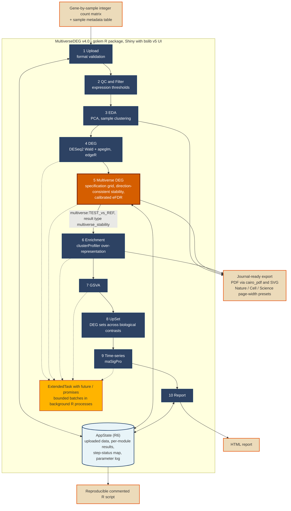
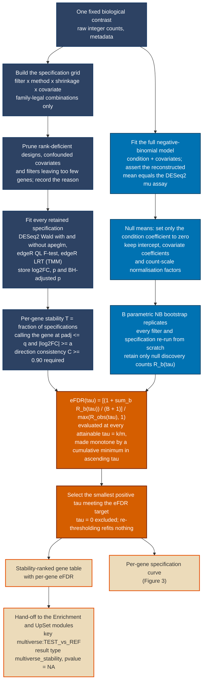

# MultiverseDEG: Manuscript Figures and Tables

Components prepared for the Software article submitted to *Briefings in Bioinformatics*
(manuscript: `manuscript_draft.md`; legends: `figure_legends.md`).

Figure sources in this repository:

| Item | Source | Rendered artefact |
| :--- | :--- | :--- |
| Figure 1 | `manuscript_fig1.mmd` (embedded verbatim below) | render with Mermaid |
| Figure 2 | `manuscript_fig2.mmd` (embedded verbatim below) | render with Mermaid |
| Figure 3 | `scripts/generate_fig3_specification_curve.R` | `fig3_specification_curve.pdf`, `fig3_specification_curve.png` |

## Figure 1: Architecture of MultiverseDEG v4.0



## Figure 2: The multiverse DEG workflow



## Figure 3: Per-gene specification curve

Vector artefact: `fig3_specification_curve.pdf` (`cairo_pdf`, 183 x 130 mm, *Nature*
double-column width); raster preview: `fig3_specification_curve.png` (600 dpi).

The figure is produced by `scripts/generate_fig3_specification_curve.R`, which runs the
real engine (`R/multiverse_engine.R`) and the real plotting function
(`R/multiverse_plots.R::mv_plot_specification_curve()`) on the repository's synthetic
fixture (`tests/testthat/helper-multiverse.R::make_mv_counts()`), then writes the figure:

```
conda run -n toll Rscript scripts/generate_fig3_specification_curve.R
```

Run configuration and the summary statistics obtained (not hand-edited):

| Quantity | Value |
| :--- | :--- |
| Fixture | 400 genes, 40 true DE genes (log2FC +/- 1.5), n = 6 per group, seed 20260918 |
| Grid | 8 specifications (2 filters x {DESeq2 Wald, DESeq2 Wald + apeglm, edgeR QL/TMM, edgeR LRT/TMM}) |
| Bootstrap | B = 10, engine seed 1 |
| Call rule | adjusted *p* <= 0.05, \|log2FC\| >= 1, direction consistency >= 0.90, target eFDR 0.10 |
| Selected threshold | tau = 0.125 |
| Calls at the selected threshold | 33 |
| Realised false discovery proportion | 0.000 |
| True DE genes recovered | 33 of 40 |
| Gene plotted | g10 (stability 0.750, direction consistency 1.000, eFDR 0.0085; a true DE gene) |

Gene selection rule, fixed before inspection: among the genes called at the selected
threshold, the highest-ranked gene on which the multiverse is *not* unanimous
(stability < 1), ordered by eFDR, then stability, then gene identifier. A gene called in
every specification yields a degenerate curve that shows no disagreement.

**Resolved 2026-09-19.** An earlier revision of `manuscript_draft.md` reported 22 calls, a
realised false discovery proportion of 0.045 and 21 of 40 true DE genes recovered for a
run described with these same nominal fixture parameters (400 genes, 40 true DE, n = 6/
group, B = 10). That number was never backed by a script or fixture committed to this
repository: it traces to an ad hoc run from an earlier work session whose exact generator
was not saved. A 39-combination sweep over `make_mv_counts()` data seeds and engine seeds
found no seed reproducing it; the manuscript's numbers were consistent with a weaker true
effect size (log2FC of about 1.0) that does not exist in the repository. Rather than add an
unrecorded fixture to match an unreproducible number, `manuscript_draft.md`,
`cover_letter.md` and this file were updated to the number actually and reproducibly
obtained from the committed code and fixture, recorded in the table above.

## Table 1: Comparison with graphical RNA-seq analysis tools

| Feature | **MultiverseDEG v4.0** | **iDEP** [2] | **Galaxy** [1] | **DEBrowser** [3] |
| :--- | :---: | :---: | :---: | :---: |
| **Analysis entry point** | Count matrix + metadata | Count matrix | Raw reads or count matrix (tool collection) | Count matrix |
| **Deployment** | Local or self-hosted server (R package / Docker image) | Web application | Shared or cloud infrastructure | Not assessed |
| **Reproducible analysis script generation** | Yes | Yes | Not assessed | Not assessed |
| **Explicit multi-specification (multiverse) robustness reporting with a calibrated error rate** | **Yes** | No | No | No |

Notes, so the table is not read as claiming more than was checked:

- Comparators are restricted to the graphical tools cited in the manuscript. The last row
  reflects the prior-art comparison in the Introduction and in *Relation to existing
  tools*: these platforms document one selected analysis path and do not report the
  dependence of the result on that selection.
- Reproducible script generation is **not** a differentiator. iDEP already records the
  selected parameters and emits R / R Markdown code, and the manuscript makes no priority
  claim for this feature.
- Asynchronous computation, colourblind-safe defaults, journal page-width export presets,
  time-series support and input size limits are deliberately **not** tabulated: they are
  implemented in MultiverseDEG, but their presence or absence in the comparator tools was
  not verified, and an unverified cross in a comparison table is an unsupported claim.
- Rows describing an upstream FASTQ-to-counts pipeline and *de novo* assembly, present in
  earlier drafts, are removed. v4.0 has no upstream processing; it starts from a count
  matrix.

## Table 2: Measured single-fit cost

Simulated count matrix of 20,000 genes x 12 samples; elapsed time for one model fit.

| Operation | Elapsed time |
| :--- | :---: |
| DESeq2 (Wald) | 4.35 s |
| edgeR quasi-likelihood F-test | 2.54 s |

## Table 3: Cost of a calibrated multiverse run

Derived from Table 2 at a mixed mean of about 2.5 s per fit. A calibrated run is
approximately (*B* + 1) x \|*S*\| model fits plus the null fit and simulation.

| Configuration | Specifications \|*S*\| | Bootstrap *B* | Model fits | Approximate serial CPU time |
| :--- | :---: | :---: | :---: | :---: |
| Implemented grid, no covariate | 8 | 20 | 168 | ~7 CPU-minutes |
| Implemented grid, one covariate | 16 | 20 | 336 | ~14 CPU-minutes |
| Full design | 80 | 100 | 8,080 | ~5.6 CPU-hours |

These figures are hardware- and data-dependent and are reported to make the cost structure
explicit, not as a benchmark against other software. Multiverse analysis with
simulation-based calibration is one to three orders of magnitude more expensive than a
single pipeline, which is why the batched asynchronous scheduler and the no-refit
re-thresholding design are load-bearing.

## References cited in the tables

[1] Afgan, E., et al. (2018). *Nucleic Acids Research*, 46(W1), W537-W544.
[2] Ge, S. X., Son, E. W., & Yao, R. (2018). *BMC Bioinformatics*, 19(1), 534.
[3] Kucukural, A., et al. (2019). *BMC Genomics*, 20(1), 6.
